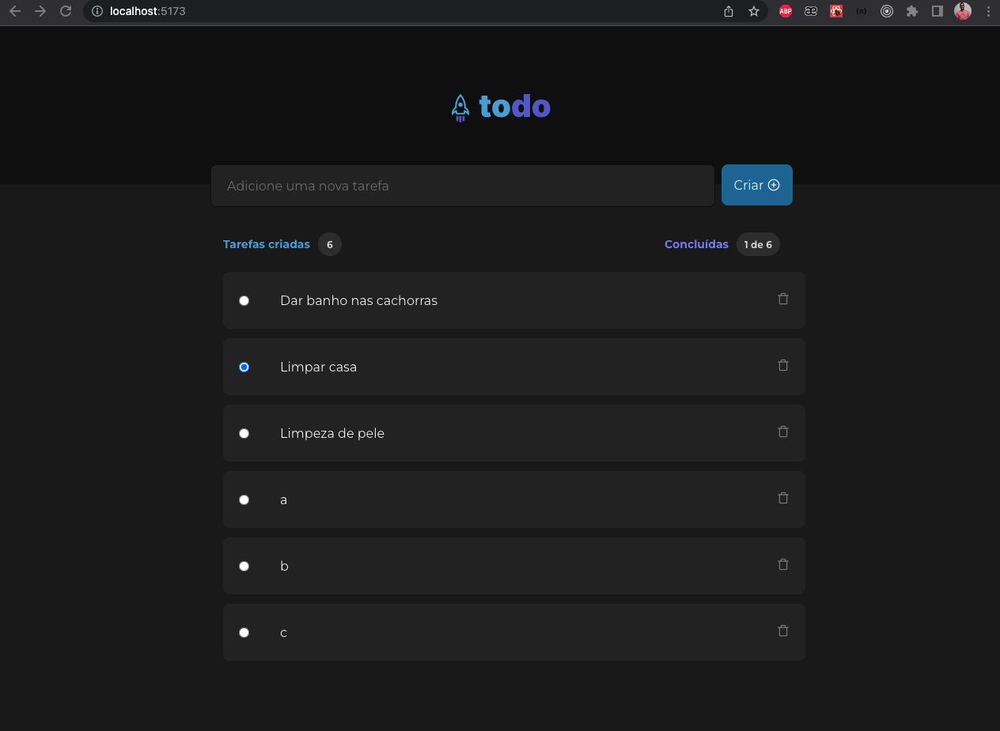
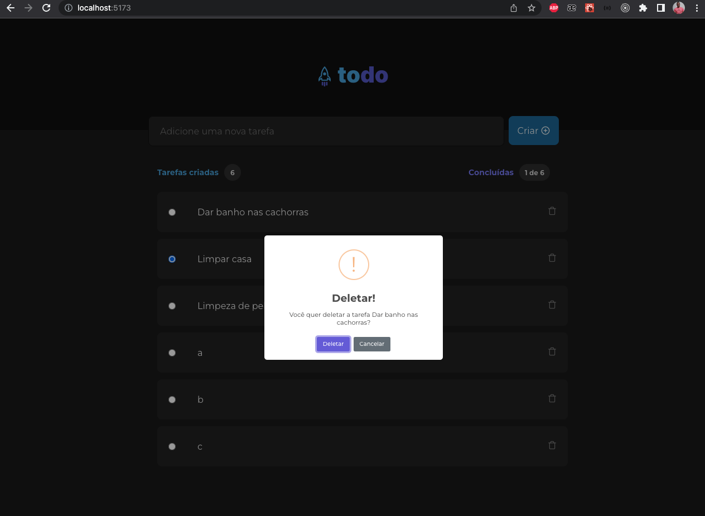
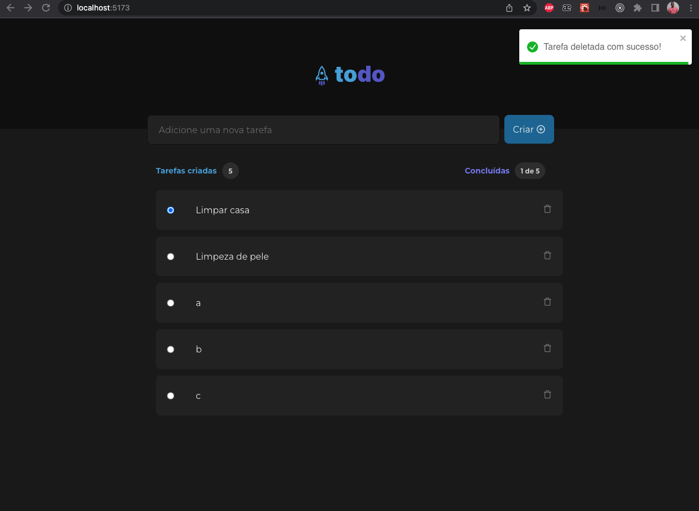

## Desafio 01 rocketseat

O Desafio consistia em criar um todo lists.

## Configuração

1. Instale o <a href="https://www.npmjs.com/package/json-server">json-server</a>

2. Execute o comando yarn install

3. Execute o comando json-server --watch db.json

4. Em um outro terminal execute o comando yarn dev

5. Acesse http://localhost:5173/

### Listagem

### Deleção

